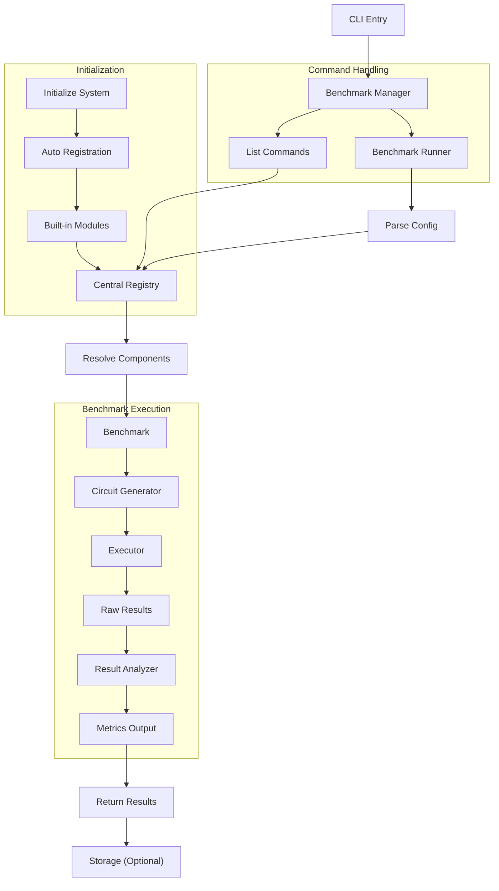

# Architecture Overview

The **MQSS Benchmarking Framework** is organized as an extensible orchestration layer for quantum benchmarking workflows.

> **Note**
> This document provides a high-level overview of the current MQSS Benchmarking Framework architecture. The framework is under active development, and additional architectural details, diagrams, and component documentation may be added as the project evolves.

## Design goals

- Support multiple benchmark types
- Integrate hardware backends and simulators consistently
- Keep components modular and replaceable
- Enable easy extension via new benchmarks, suites, and plugins

## Core ideas

### Registry-based component model

MQSS Benchmarking Framework uses a registry-driven system where all components are registered, discovered, and instantiated dynamically at runtime.

### Abstract interfaces

All framework components communicate through abstract interfaces rather than direct implementations. This ensures modularity and extensibility.

### Plugin discovery

MQSS Benchmarking Framework supports a plugin-based architecture so new benchmarking components can be added without modifying the core framework.

## Main components

- **Benchmarks**: define what is measured and evaluated
- **Device adapters**: interface with hardware backends and simulators
- **Circuit providers**: supply circuits or workload definitions
- **Framework core**: handles discovery, setup, orchestration, and execution flow

## Execution flow

1. A benchmark is selected via CLI with config file.
2. Required components are resolved through the registry.
3. Backend or simulator is selected via device adapter.
4. Benchmark execution is performed.
5. Results are collected and processed into metrics and plots.
6. Final results are stored or returned to the user.

### Execution Flow Diagram

---

← [Back to Documentation Home](../index.md)