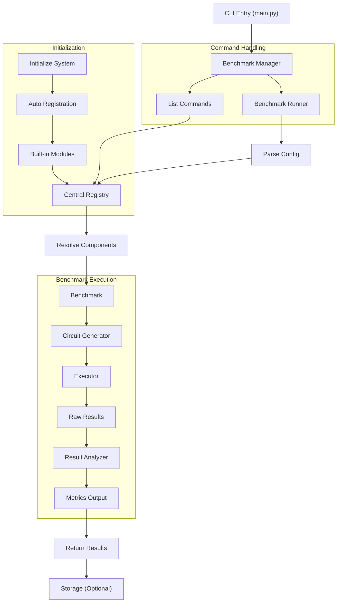

# System Architecture Diagram

```mermaid
flowchart TD

    %% -----------------------
    %% Initialization (Side)
    %% -----------------------
    subgraph Init["Initialization"]
        INIT["Initialize System"]
        REG["Auto Registration"]
        MODS["Built-in Modules"]
        REGISTRY["Central Registry"]

        INIT --> REG --> MODS --> REGISTRY
    end


    %% -----------------------
    %% Entry
    %% -----------------------
    CLI["CLI Entry (main.py)"] --> MANAGER["Benchmark Manager"]


    %% -----------------------
    %% Command Handling
    %% -----------------------
    subgraph Commands["Command Handling"]

        %% Info / Listing Commands
        MANAGER --> LIST["List Commands"]
        LIST --> REGISTRY

        %% Execution Commands
        MANAGER --> RUNNER["Benchmark Runner"]
    end


    %% -----------------------
    %% Execution Flow
    %% -----------------------
    RUNNER --> CONFIG["Parse Config"]
    CONFIG --> REGISTRY

    REGISTRY --> COMPONENTS["Resolve Components"]
    COMPONENTS --> BENCH["Benchmark"]


    %% -----------------------
    %% Benchmark Execution Core
    %% -----------------------
    subgraph Core["Benchmark Execution"]

        BENCH --> GEN["Circuit Generator"]
        GEN --> EXEC["Executor"]
        EXEC --> RESULTS["Raw Results"]
        RESULTS --> ANALYZER["Result Analyzer"]
        ANALYZER --> METRICS["Metrics Output"]

    end


    %% -----------------------
    %% Finalization
    %% -----------------------
    METRICS --> RETURN["Return Results"]
    RETURN --> STORAGE["Storage (Optional)"]
```
